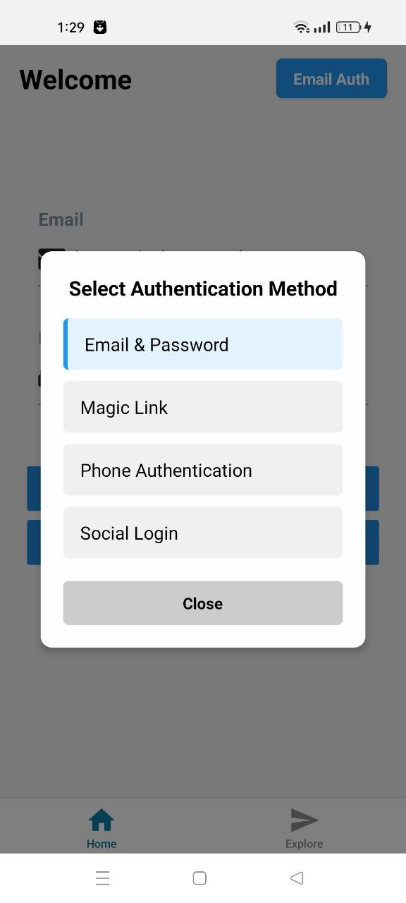
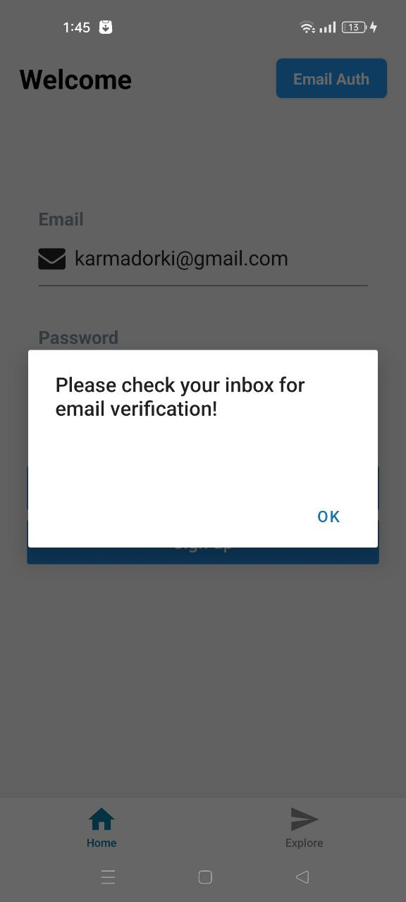
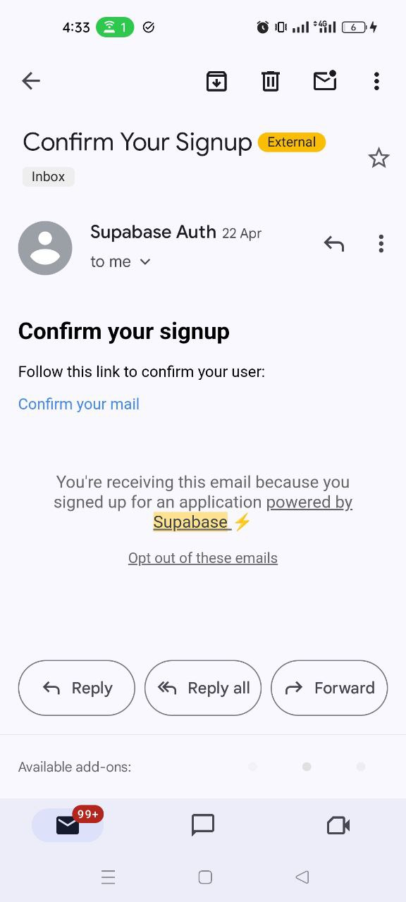
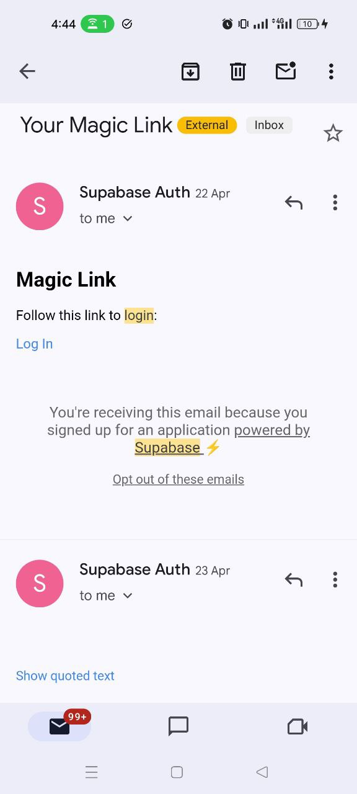
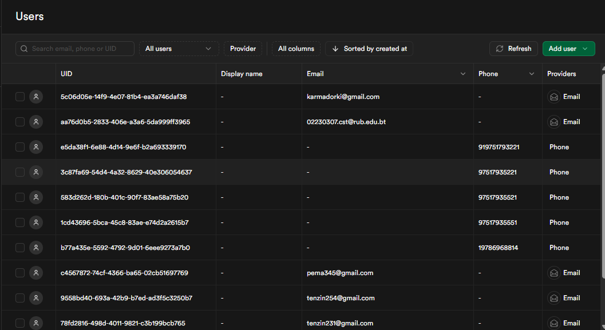

<<<<<<< HEAD
## Supabase Authentication & Authorization with Supabase

I have implemented multiple authentication strategies using Supabase in my React Native application using Supabase. I followed the steps from the official Supabase documentation. Here's what I did:

1. Email & Password

2. Magic Link

3.  Phone Authentication

This image showcases the UI design, I created for the different login options in the app.

### Password-Based Login
I created a authentication component that handles both sign-in and sign-up functionality. Ths includes:

1. Input fields for email and password with appropriate validation.
2. Shows success and error alerts to let users know if the action worked or not.
alt text

I used Supabase's built-in email verification. After sign-up, a confirmation email is sent to the user. The image below shows the email with a link to verify the account.

### Magic-link : 

I built a simple passwordless login system using magic links with Supabase and React Native. Users enter their email and receive a secure link that logs them in automatically.

### Phone Login

I set up phone authentication in Supabase with Twilio integration for SMS delivery. Users enter their phone number in the app and request an OTP. 

My implementation shows that the OTP is sent successfully (as seen in the screenshot), 

but I faced a challenge where the OTP isn't being received on my local device for testing purposes.

All authentication methods work successfully on the backend, with user credentials properly stored in Supabase's user management system.

### My understanding 

Throughout the process of implementing multiple authentication strategies in my React Native application using Supabase, I've learned many things :

1.  I learned how to implement and combine different authentication approaches (password-based, magic link, and phone OTP) within a single application

2. I now understand how to monitor and manage user authentication data through the Supabase dashboard

3. I gained experience connecting Twilio with Supabase for SMS delivery

4.  I understand how Supabase manages user sessions and how to integrate this with the frontend
=======
##  Authentication & Authorization with Supabase - Practical Report

I have implemented multiple authentication strategies using Supabase in my React Native application
using Supabase. I followed the steps from the official Supabase documentation. Here's what I did:

### 1. App Login UI Overview

1.  This image showcases the UI design, I created for the different login options in the app.

When clicking " Email Auth " :

### 2. Password-Based Login

I created a authentication component that handles both sign-in and sign-up functionality. Ths includes:

#### 1. Input fields for email and password with appropriate validation. 

#### 2. Shows success and error alerts to let users know if the action worked or not.

>>>>>>> 68c788df6e3f8516fb9ed73c30d43d87f2ea2098

